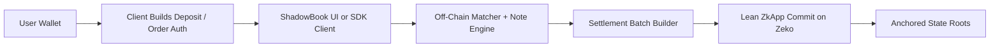
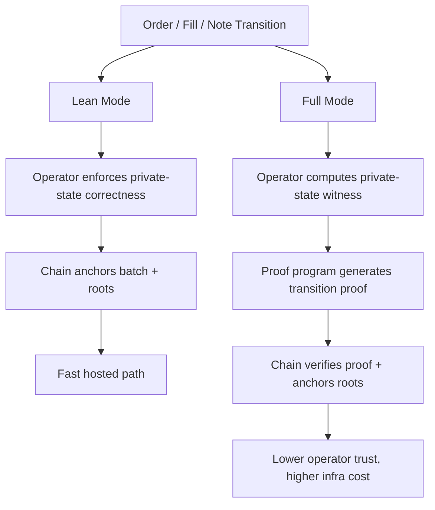
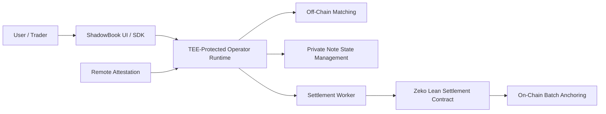
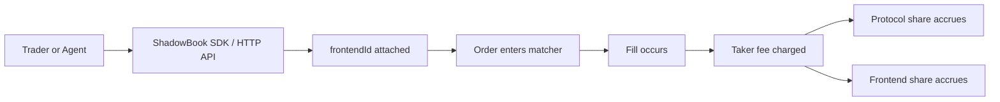

# ShadowBook: A Lean Private Order Book on Zeko

ShadowBook is a private order book exchange built to show that privacy, speed, and practical deployment can coexist without pretending the system is more decentralized than it really is. At its core, ShadowBook combines fast off-chain matching, note-backed trading, wallet-signed order authorization, and batched on-chain settlement anchoring on Zeko. Users deposit assets on-chain, convert those deposits into private notes, place public-anonymous or private-dark orders, and then settle the resulting state transitions in batches through a lightweight zkApp. That architecture matters because it gives us a real market that is fast enough to use, structured enough to audit, and small enough to host cleanly. Recent work pushed the product further in exactly that direction: the default deployment path now uses a lean settlement contract, wallet-signed order authorization is cryptographically verified server-side, settlement batching is draining on-chain, activity history is persisted across restarts, and the UI now supports tighter funding flows and order-book click-to-prefill. The result is not a research mockup. It is a working private trading system with a clear security model and a credible path to stronger verification later.

The key architectural choice in ShadowBook is the lean path. In lean mode, the operator enforces the correctness of private state transitions off-chain, while the chain verifies and records the batch commits and resulting state roots. That means the chain is anchoring what happened, sequencing settlement, and giving the system an immutable settlement boundary, but it is not yet verifying every note spend, nullifier transition, or private accounting update cryptographically inside the contract. That is deliberate. Many private exchange designs either try to prove too much too early and become hard to run, or keep too much off-chain and become hard to trust. ShadowBook takes the middle route: private notes preserve balance privacy, public-anonymous orders can contribute displayed liquidity without exposing wallets, private-dark orders can remain invisible until execution, and batched on-chain settlement gives the venue a real finality layer. This makes the system usable now. It also creates a cleaner foundation for the stronger path later, instead of overloading the first release with proving infrastructure that slows everything down.

That lean path has become more robust over time. The wallet auth flow is tighter now: orders require wallet-signed authorization, those signatures are cryptographically verified, and authorization nonces are consumed to prevent replay. The settlement path is simpler than before because the hosted runtime defaults to the lean settlement contract rather than dragging the proof-heavy contract into every deployment. We also separated advanced code paths from the demo path so the main product can stay reliable while more advanced teams explore full proof verification or on-chain order book variants in parallel. Operationally, the live system has already exercised deposits, note minting, public and private orders, limit and market trades, withdrawals, settlement batching, and payout execution. That matters because ShadowBook’s story is no longer just “this architecture could work.” It is “this architecture works now, and here is exactly how it can evolve.”

Privacy in ShadowBook comes from a combination of note-backed balances and flexible order visibility rather than from a single monolithic privacy primitive. Public-anonymous orders reveal price and size in the book, but do not expose the user wallet. Private-dark orders stay off-book before execution. Notes keep funding and collateral management more private than direct wallet-native trading. That makes ShadowBook a pragmatic hybrid privacy exchange. It is not a fully chain-native private DEX, and it is not claiming end-to-end trustlessness today. But it does offer meaningful privacy properties where users actually feel them: funding, displayed identity, and pre-trade discretion. That is why the product can move quickly while still being honest about its trust boundary.

The future full path is where cryptographic verification gets much stronger. In that mode, the same general product flow remains in place, but instead of trusting the operator to enforce note spend correctness, nullifier freshness, and private-state transitions, the chain also verifies zero-knowledge proofs that those transitions were valid. In other words, lean mode says: “the operator computed this private transition, and the chain anchored the result.” Full mode says: “the operator computed this private transition, and the chain also verified cryptographically that the result was correct.” That is a meaningful upgrade in trust minimization, especially for counterparties, partners, or teams that want stronger cryptographic guarantees around private accounting. We have already scoped and implemented those advanced reference paths in the repo as separate code-level options, including a proof-heavy settlement track and an isolated on-chain order book reference path. They are not the default product path, but they are now real implementation scaffolds for teams that want to run larger machines, dedicated provers, or more advanced operator infrastructure.

There is also an important middle ground worth calling out: lean mode can still become a very strong security posture if the operator runs inside an attested TEE. That is not the same as full on-chain proof verification, but it is stronger than a plain off-chain server. If the ShadowBook operator, matcher, and settlement service run inside an attested confidential environment, then the system gains execution confidentiality and attestation around the operator runtime itself while still settling on Zeko. That gives a strong practical trust model for teams that want more security than a normal cloud deployment without immediately taking on the full proof-heavy settlement path. The important distinction is that TEE-backed lean mode strengthens execution trust, while full mode strengthens cryptographic verification. They are complementary models, not interchangeable claims.

Another part of the design that matters is integration. ShadowBook is not just a browser UI. It already exposes a working SDK and HTTP API surface that let agents, partner frontends, or operator-run automation interact with the market directly. A frontend can attach a stable `frontendId` and earn a configured share of taker fees on routed flow, while the protocol earns the remainder. An agent can use the JavaScript SDK or raw HTTP calls to sync balances, query markets, build deposit transactions, select notes, place orders, replace orders, cancel orders, and inspect settlement state. That makes the system not just a product demo but an extensible protocol surface: one core engine, multiple possible frontends, and a routing model where the protocol and interface operator can both participate economically.

That is why we landed on this design. We wanted a private exchange that is fast, credible, and deployable. We wanted a product that could support real deposit, trade, and withdrawal flows without collapsing under proving cost. We wanted a clean trust model rather than marketing theater. And we wanted a path forward for more advanced teams who want proof-heavy verification or even on-chain order book research. ShadowBook’s default lean path gives us a real exchange today. Its advanced paths give us credible extensibility tomorrow. That is a much stronger foundation than trying to ship a “fully decentralized private exchange” claim before the engineering and infrastructure are ready to support it.

## Flow Charts

### Lean Runtime

### Lean vs Full

### TEE-Backed Lean Deployment

### Agent / Frontend Routing

